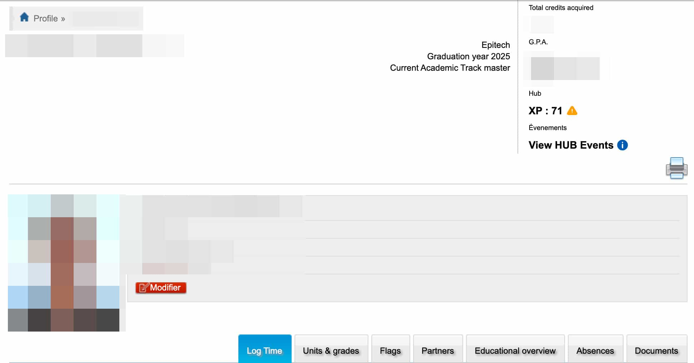
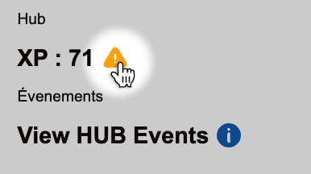
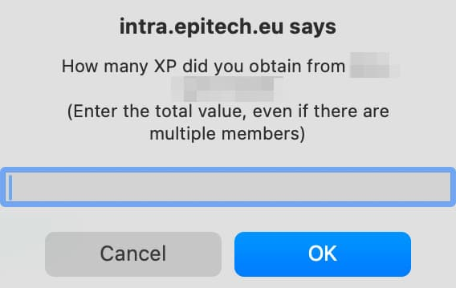
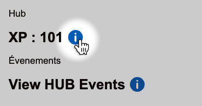
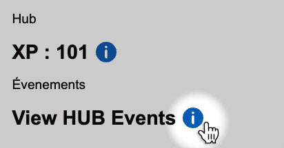

<h1>HUB Reworked</h1>

A simple tool to calculate the amount of XP you currently have to validate your Epitech Hub module.

## Installation

Get the latest release from the [releases page](https://github.com/phil-chp/HUB-Reworked/releases), download `hub-reworked.zip` and extract it.

Add the app as an extension to your chrome browser. To do so, first go to `chrome://extensions`, on the top right enable "Developer Mode", then on the top left, you can select "Load unpacked". Select the folder you just extracted from `hub-reworked.zip`, and you should be good!

## Tutorial

Go to <https://intra.epitech.eu> and log in if you are not already. Then go to your user profile.

If you did the [installation](#installation) correctly, you should see two new section below your G.P.A.

### Hub XP

This section shows you the amount of XP you currently have, depending on your situation you might encounter two different icons.

#### Orange warning

This means that Hub Reworked is missing XP information about Project(s) and/or Experience(s) you have done.

Please click on the icon, a series of questions will be prompted via an alert popup, asking you about the amount of XP you have gained for each specific activity.

_❗ This will only be asked **once** per Project or Experience. Don't worry!_

After submitting all the information required, you will see a new symbol appear, and you will see your XP updated to take into account the new information.

_❗ As specified in the alert popup, if you have to submit the XP for a Project you did with other peers, enter the total value of the project (Example: 42xp project for 2 people should be 21xp/person, this is handled by Hub Reworked, you should submit "42" instead of "21")._

#### Blue info

This means that Hub Reworked has all the information it needs to calculate your XP. You can view your total XP directly next to the info circle.

If you wish to get more information, please click on the icon, this will open a popup table containing information about all your Hub activities with some extra details about them.

### Hub Event suggestions

As an extra feature, Hub Reworked will suggest you some events you can do to gain more XP, these events are usually Talks or Workshops, around your city. This is determined via the location information of your campus.

Click on the blue info icon to see the events.

## OpenAI Idea generator

Currently this feature is not compatible with releases, I reached my delivery dead-line and I'm overloaded with work so I will not be implementing it shortly, if you which to use it, you can just:

1. clone the latest version of the repo
2. add a `.env` file in the root
3. inside add: `OPENAI_API_KEY=<your_key>` (❗ Make sure to give the kep "all" permission, there is a bug from the OpenAI team, for some reason the openai npm package tries to access routes even though you don't use them, and just crashes if you restrict it)
4. `yarn install`
5. `yarn build`
6. Load this folder as an unpacked extension in the chrome extensions page.
